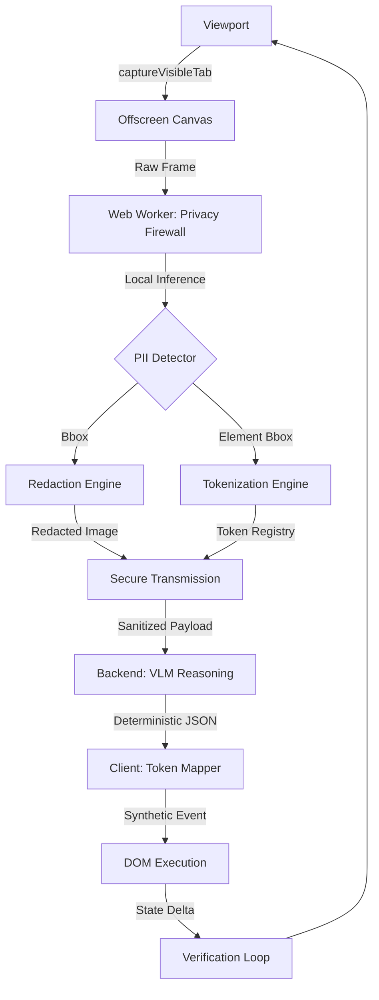

# AegisEdge Execution Plan - ISRO SIH26171

## 1. System Architecture Overview

### 1.1 End-to-End Dataflow (Mermaid)


### 1.2 Repository Topology
```text
aegisedge/
├── extension/                # Chrome Extension (Manifest V3)
│   ├── manifest.json         # Extension configuration
│   ├── background/           # Service worker for orchestration
│   ├── content/              # DOM injection & Synthetic event dispatch
│   ├── offscreen/            # Canvas capture & DOM-level masking
│   ├── workers/             # WebGPU/WASM Inference (Transformers.js/ONNX)
│   │   ├── vision_worker.js  # PII & Element detection
│   │   └── redaction.js      # Visual masking logic
│   └── ui/                   # Overlay HUD for debugging redaction
├── backend/                  # FastAPI / vLLM Service
│   ├── main.py               # API Entry point
│   ├── inference/            # VLM Pipeline (Qwen2-VL / Phi-3.5)
│   ├── schemas/              # Pydantic Action Contracts
│   └── utils/                # Token parsing & coordinate mapping
├── models/                   # Model Assets & Quantization
│   ├── onnx/                 # Quantized local models (INT8)
│   └── config/               # Model hyperparameters
├── evaluation/               # Benchmarking Suite
│   ├── pii_benchmark/       # Synthetic PII datasets
│   ├── latency_profiler.py   # Segmented timing logs
│   └── resource_monitor.py   # RAM/CPU usage tracker
└── docs/                     # Documentation
    ├── PROBLEM_STATEMENT.md
    └── EXECUTION_PLAN.md
```

## 2. Technology Stack

| Component | Technology | Version/Spec | Reason |
| :--- | :--- | :--- | :--- |
| **Client Runtime** | Chrome Extension | Manifest V3 | Latest browser security standards |
| **Local Inference** | Transformers.js / ONNX | v3.0+ (WebGPU) | Hardware acceleration in-browser |
| **Local Model** | MobileNetV4 / ViT-Tiny | INT8 Quantized | Low RAM footprint ($\le 600\text{MB}$) |
| **Server Runtime** | FastAPI / Python 3.11 | ASGI | High-performance asynchronous I/O |
| **Reasoning Model** | Qwen2-VL / Phi-3.5 Vision | Open-Weights | State-of-the-art VLM reasoning |
| **Data Format** | WebP / JSON | Lossy (for speed) | Minimize network latency |

## 3. Data Contracts & Interfaces (Pass 3)

### 3.1 Client-Side TypeScript Interfaces
```typescript
/** 
 * Local surrogate token registry 
 * Maps an anonymized token to its actual DOM coordinates
 */
interface TokenRegistry {
  [tokenId: string]: {
    coordinates: { x: number; y: number; width: number; height: number };
    originalSelector: string; // Used only locally for event dispatch
    label: string;            // e.g., "button", "input_field"
  };
}

/** 
 * Payload sent to the backend. 
 * Contains ONLY sanitized data.
 */
interface SanitizedPayload {
  taskId: string;
  objective: string;          // User's goal (e.g., "Click the submit button")
  redactedImage: string;      // Base64 encoded WebP image (PII blurred)
  tokens: Array<{            // Structural metadata without PII
    id: string;               // e.g., "[ACTION_BTN_1]"
    bbox: [number, number, number, number]; // [x, y, w, h] relative to image
    label: string;            // "button", "link", etc.
  }>;
  viewportSize: { width: number; height: number };
}
```

### 3.2 Server-Side Python Pydantic Schemas
```python
from pydantic import BaseModel, Field
from typing import Optional, Literal

class ActionResponse(BaseModel):
    thought: str = Field(..., description="VLM's step-by-step reasoning")
    action: Literal["CLICK", "TYPE", "SCROLL", "WAIT", "TERMINATE"]
    target_token: Optional[str] = Field(None, description="The [TOKEN_ID] to act upon")
    value: Optional[str] = Field(None, description="Text value for TYPE actions")
    confidence: float = Field(..., ge=0, le=1.0)

class RequestPayload(BaseModel):
    taskId: str
    objective: str
    redactedImage: str # Base64 WebP
    tokens: list[dict]  # List of token metadata
    viewportSize: dict
```

## 4. Failure Modes & Edge Cases (Pass 4)

### 4.1 Critical Failure State Matrix

| Failure Mode | Root Cause | Mitigation Strategy | Self-Healing Mechanism |
| :--- | :--- | :--- | :--- |
| **DOM Mutation** | Page changes between capture and action | Use `IntersectionObserver` + Hash check | If target token coordinates mismatch current DOM, trigger re-capture loop |
| **Low Confidence** | VLM confidence score $\le 0.70$ | Threshold-based rejection | Server returns `action: "WAIT"`, client requests higher-res crop of target area |
| **WebGPU Unsupported**| Hardware/Driver incompatibility | WASM Execution Provider Fallback | Graceful degradation to WASM (CPU), with user notification of increased latency |
| **Over-Masking** | PII model flags UI control as PII | Semantic priority filter | Prioritize `interactive: true` DOM attributes over Vision-based PII flags for UI controls |
| **Network Timeout** | High latency $\ge 1.8\text{s}$ | Request timeouts + Exponential Backoff | Fail-safe `TERMINATE` signal to prevent infinite loop; notify user |

### 4.2 Edge Case Handling
- **Invisible Captures:** If a website attempts to hide PII using CSS `opacity: 0` or `z-index` tricks, the `Offscreen Canvas` capture bypasses CSS visibility to ensure the Vision Model sees the actual pixels.
- **Dynamic Canvas:** For canvas-rendered text (e.g., maps, charts), the Vision model performs OCR locally to redact PII before the image is sent to the server.
- **Ambiguous Tokens:** If two elements have identical visual signatures, the Tokenization Engine appends a spatial hash to the token (e.g., `[BTN_TOPLEFT_1]`) to ensure VLM specificity.

## 5. Evaluation & Metrics (Pass 1)

### 5.1 Metric Decomposition

| Metric | Weight | Engineering Definition | Acceptance Criteria | Benchmarking Method |
| :--- | :---: | :--- | :--- | :--- |
| **Visual Context Accuracy** | 25% | $\text{mIoU}$ of detected interactive elements vs. ground truth DOM boxes. | $\text{mIoU} \ge 0.85$ | Comparison of Vision Model output vs. `getBoundingClientRect()` |
| **PII Detection** | 20% | $\text{Recall} = \frac{TP}{TP + FN}$; $\text{Precision} = \frac{TP}{TP + FP}$ | $\text{Recall} \ge 0.98$, $\text{Precision} \ge 0.90$ | Synthetic PII dataset benchmark |
| **Redaction Precision** | 20% | $\text{Overmask Rate} = \frac{\text{Redaction Area} \cap \text{Control Area}}{\text{Total Redaction Area}}$ | $\text{Overmask Rate} \le 5\%$ | Overlap analysis with known UI coordinates |
| **Resource Utilization** | 20% | $\text{Avg CPU} \le 25\%$, $\text{Peak RAM} \le 600\text{MB}$, No UI Thread Blocking | $\text{RAM} \le 600\text{MB}$, $\text{CPU} \le 25\%$ | Chrome DevTools / `performance.memory` |
| **End-to-End Latency** | 15% | $T_{\text{total}} = T_{\text{capture}} + T_{\text{local\_inf}} + T_{\text{network}} + T_{\text{server\_inf}} + T_{\text{dispatch}}$ | $T_{\text{total}} \le 1.8\text{s}$ | Segmented `performance.now()` tracing |


### 3.1 Metric Decomposition

| Metric | Weight | Engineering Definition | Acceptance Criteria | Benchmarking Method |
| :--- | :---: | :--- | :--- | :--- |
| **Visual Context Accuracy** | 25% | $\text{mIoU}$ of detected interactive elements vs. ground truth DOM boxes. | $\text{mIoU} \ge 0.85$ | Comparison of Vision Model output vs. `getBoundingClientRect()` |
| **PII Detection** | 20% | $\text{Recall} = \frac{TP}{TP + FN}$; $\text{Precision} = \frac{TP}{TP + FP}$ | $\text{Recall} \ge 0.98$, $\text{Precision} \ge 0.90$ | Synthetic PII dataset benchmark |
| **Redaction Precision** | 20% | $\text{Overmask Rate} = \frac{\text{Redaction Area} \cap \text{Control Area}}{\text{Total Redaction Area}}$ | $\text{Overmask Rate} \le 5\%$ | Overlap analysis with known UI coordinates |
| **Resource Utilization** | 20% | $\text{Avg CPU} \le 25\%$, $\text{Peak RAM} \le 600\text{MB}$, No UI Thread Blocking | $\text{RAM} \le 600\text{MB}$, $\text{CPU} \le 25\%$ | Chrome DevTools / `performance.memory` |
| **End-to-End Latency** | 15% | $T_{\text{total}} = T_{\text{capture}} + T_{\text{local\_inf}} + T_{\text{network}} + T_{\text{server\_inf}} + T_{\text{dispatch}}$ | $T_{\text{total}} \le 1.8\text{s}$ | Segmented `performance.now()` tracing |

### 3.2 Benchmarking Scenarios
1. **PII Leakage Test:** Pages containing mixture of passwords, emails, and faces. Failure = any unmasked PII exiting client.
2. **UI Control Accessibility Test:** Complex dashboards with dense controls. Failure = redaction covering "Submit" or "Login" buttons.
3. **Stress Test:** Tab-heavy environments. Failure = RAM exceeding 600MB or CPU causing page stutter.
